<h2>TensorFlow-FlexUNet-Image-Segmentation-Cardiac-Diagnosis-MRI (2025/11/01)</h2>

This is the first experiment of Image Segmentation for<b>Automated Cardiac Diagnosis Challenge (ACDC) 3 classes</b>,
 based on our 
TensorFlowFlexUNet (TensorFlow Flexible UNet Image Segmentation Model for Multiclass) 
and a 512x512 pixels 
<a href="https://drive.google.com/file/d/1VdxnmE_BZknhJ30M0PHn3iYZlvRdvsFd/view?usp=sharing">
ACDC-ImageMask-Dataset.zip</a>.
which was derived by us from   
<b>ACDC_training_slices</b> subset in <a href="https://www.kaggle.com/datasets/anhoangvo/acdc-dataset/data">
<b>
ACDC Dataset
</b>
</a>

 
 

<b>Acutual Image Segmentation for 512x512 pixels Cardiac images</b> 
As shown below, the inferred masks predicted by our segmentation model trained on the 
PNG dataset appear similar to the ground truth masks,but this model failed to segment the region in the third case.
 
<table>
<tr>
<th>Input: image</th>
<th>Mask (ground_truth)</th>
<th>Prediction: inferred_mask</th>
</tr>
<tr>
<td>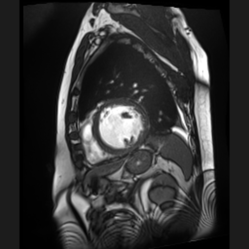</td>
<td>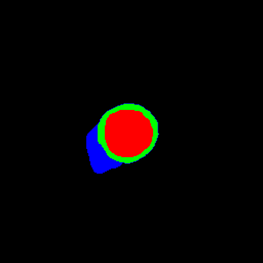</td>
<td>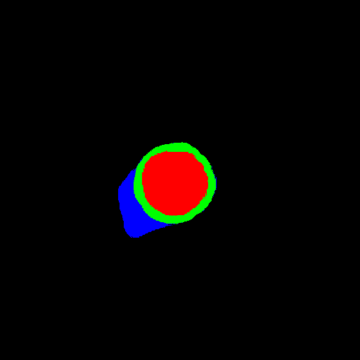</td>
</tr>
<tr>
<td>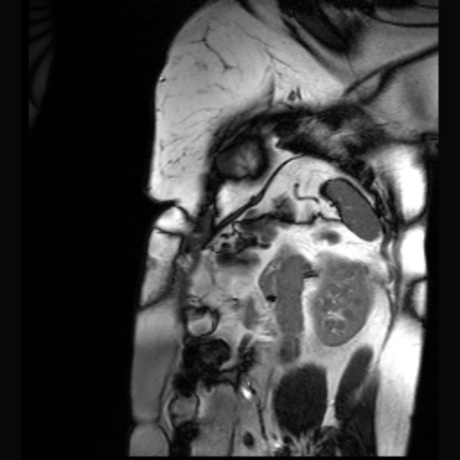</td>
<td></td>
<td></td>
</tr>
<tr>
<td>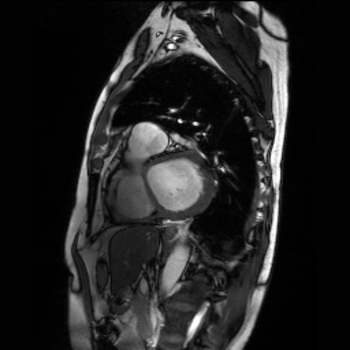</td>
<td>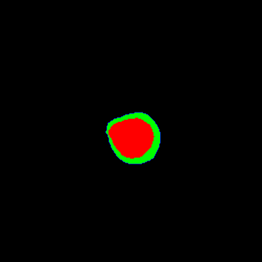</td>
<td>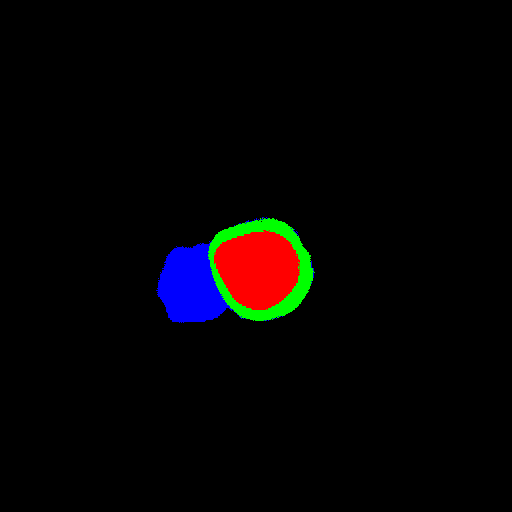</td>
</tr>
</table>

<h3>1. Dataset Citation</h3>
The dataset used was obtained from the kaggle web-site:  
<a href="https://www.kaggle.com/datasets/anhoangvo/acdc-dataset/data">
<b>
ACDC Dataset
</b>
</a>
  
<b>About Dataset</b> 
This preprocessed dataset, derived from the <b>Automated Cardiac Diagnosis Challenge (ACDC)</b>, is meticulously curated for 
cardiac image segmentation endeavors, with a primary focus on delineating the left ventricle (LV), 
right ventricle (RV), and myocardium (MYO). Featuring a diverse range of cardiac magnetic resonance (MR) 
images along with corresponding segmentation labels, 
this dataset enables researchers to explore the nuances of cardiac anatomy and pathology.
 

Additionally, this dataset is complemented by detailed scribble annotations, providing a valuable resource for 
scribble-supervised learning—a method crucial for weakly supervised learning approaches.  
The annotations are provided as described in the paper:
<a href="https://arxiv.org/pdf/2007.01152">
<b> Learning to Segment from Scribbles using Multi-scale Adversarial Attention Gates.</b> 
</a>

For comprehensive access to the original challenge and in-depth information, please refer to the 
<a href="https://www.creatis.insa-lyon.fr/Challenge/acdc/databases.html"><b>Automated Cardiac Diagnosis Challenge (ACDC)</b></a>.
 
The preprocessing of this dataset is carried out utilizing code available on the associated GitHub repository. 
 Researchers and medical practitioners alike can harness this preprocessed dataset to propel segmentation algorithms forward, 
contribute to the field of medical image analysis, and ultimately enhance patient care in cardiovascular medicine.
ties for medical students interested in breast cancer detection and diagnosis.
    
<b>Licence:</b> 
<a href="https://opensource.org/license/mit">MIT</a>
 

<h3>
<a id="2">
2 ACDC ImageMask Dataset
</a>
</h3>
<h4>2.1 Download ImageMask Dataset</h4>
 If you would like to train this ACDC Segmentation model by yourself,
 please download the dataset from the google drive 
<a href="https://drive.google.com/file/d/1VdxnmE_BZknhJ30M0PHn3iYZlvRdvsFd/view?usp=sharing">
ACDC-ImageMask-Dataset.zip</a>.
 
, expand the downloaded ImageMaskDataset and put it under <b>./dataset</b> folder to be
<pre>
./dataset
└─ACDC
    ├─test
    │   ├─images
    │   └─masks
    ├─train
    │   ├─images
    │   └─masks
    └─valid
        ├─images
        └─masks
</pre>
 
<b>ACDC Statistics</b> 
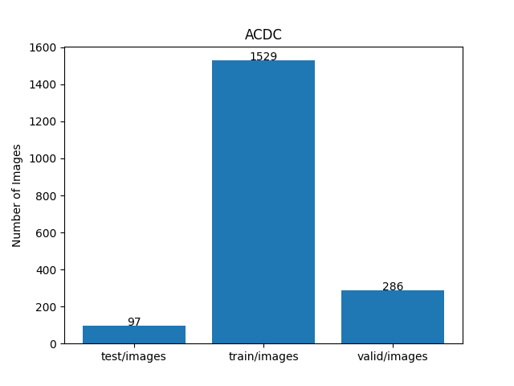 
 
As shown above, the number of images of train and valid datasets is not large to use for a training set of our segmentation model.
 
 
<h4>2.2 ImageMask Dataset Derivation</h4>
The folder struture of ACDC dataset of the kaggle is the following 
<pre>
./acdc_preprocessed
├─ACDC_testing_volumes
├─ACDC_training_slices
└─ACDC_training_volumes
</pre>
 We generated a 512x512 pixels PNG ImageMask dataset from h5 files in <b>ACDC_training_slices</b> subset in <b>/acdc_preprocessed</b>. 
All images and masks (labels) in the h5 files in the subset were resized to be 512x512 pixels, and  
the masks were colorized by using the following Grayscale and BGR triplet mapping table.  
<table border="1" style="border-collapse: collapse;">
<tr><th>Grayscale</th><th>Color name </th><th>BGR triplet</th>
</tr>
<tr><td>1</td> <td>blue</td><td>(255,0,0)</td></tr>
<tr><td>2</td> <td>green</td><td>(0,255,0)</td></tr>
<tr><td>3</td> <td>red</td><td>(0,0,255)</td></tr>
</tr>
</table>
 
<h4>2.3 Train Images and Masks Sample</h4>
<b>Train_images_sample</b> 
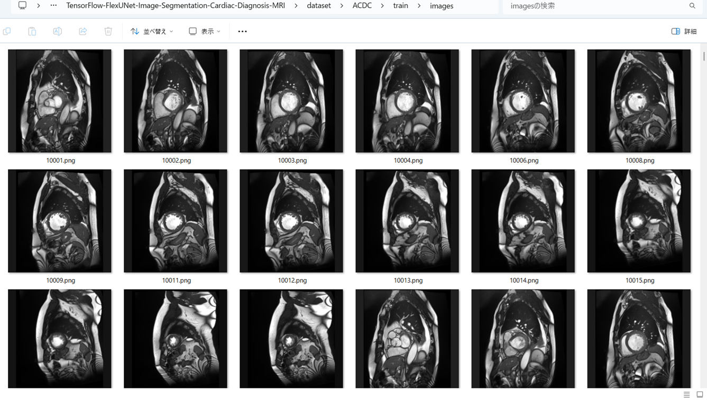
 
<b>Train_masks_sample</b> 
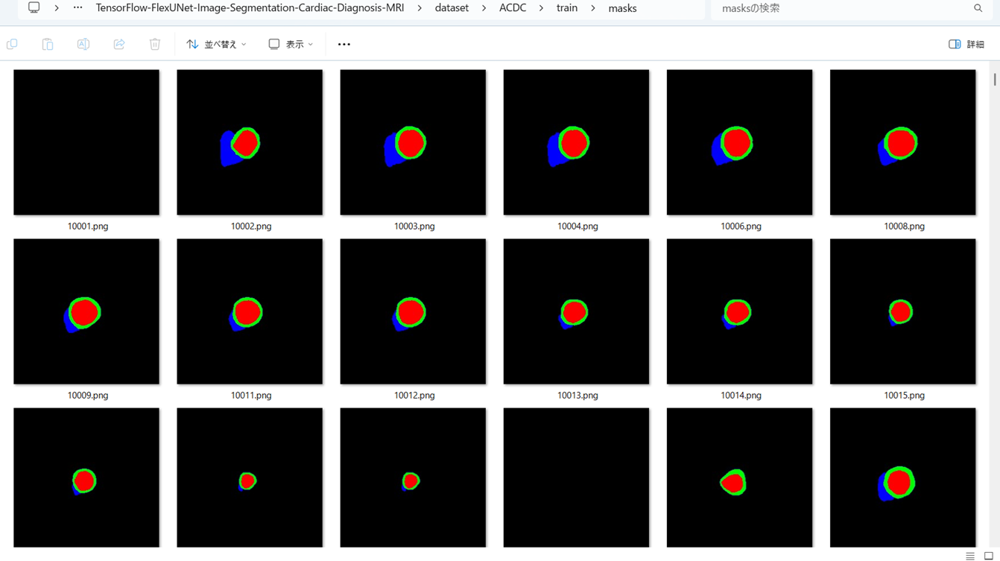
 
<h3>
3 Train TensorFlowFlexUNet Model
</h3>
 We trained ACDC TensorFlowFlexUNet Model by using the following
<a href="./projects/TensorFlowFlexUNet/ACDC/train_eval_infer.config"> <b>train_eval_infer.config</b></a> file.  
Please move to ./projects/TensorFlowFlexUNet/ACDC and run the following bat file. 
<pre>
>1.train.bat
</pre>
, which simply runs the following command. 
<pre>
>python ../../../src/TensorFlowFlexUNetTrainer.py ./train_eval_infer.config
</pre>

<b>Model parameters</b> 
Defined a small <b>base_filters = 16 </b> and large <b>base_kernels = (9,9)</b> for the first Conv Layer of Encoder Block of 
<a href="./src/TensorFlowFlexUNet.py">TensorFlowFlexUNet.py</a> 
and a large num_layers (including a bridge between Encoder and Decoder Blocks).
<pre>
[model]
;You may specify your own UNet class derived from our TensorFlowFlexModel
model         = "TensorFlowFlexUNet"
generator     =  False
image_width    = 512
image_height   = 512
image_channels = 3
num_classes    = 4

base_filters   = 16
base_kernels   = (9,9)
num_layers     = 8
dropout_rate   = 0.04
dilation       = (1,1)
</pre>
<b>Learning rate</b> 
Defined a very small learning rate.  
<pre>
[model]
learning_rate  = 0.00007
</pre>
<b>Loss and metrics functions</b> 
Specified "categorical_crossentropy" and <a href="./src/dice_coef_multiclass.py">"dice_coef_multiclass"</a>. 
<pre>
[model]
loss           = "categorical_crossentropy"
metrics        = ["dice_coef_multiclass"]
</pre>
<b>Dataset class</b> 
Specifed <a href="./src/ImageCategorizedMaskDataset.py">ImageCategorizedMaskDataset</a> class. 
<pre>
[dataset]
class_name    = "ImageCategorizedMaskDataset"
</pre>
 
<b>Learning rate reducer callback</b> 
Enabled learing_rate_reducer callback, and a small reducer_patience.
<pre> 
[train]
learning_rate_reducer = True
reducer_factor     = 0.4
reducer_patience   = 4
</pre>
<b>Early stopping callback</b> 
Enabled early stopping callback with patience parameter.
<pre>
[train]
patience      = 10
</pre>

<b>RGB Color map</b> 
rgb color map dict for ACDC 1+3 classes. 
<pre>
[mask]
mask_file_format = ".png"
; 1+3 classes         blue,          green,     red 
rgb_map = {(0,0,0):0,(0,0,255):1, (0,255,0):2, (255,0,0):3,}
</pre>

<b>Epoch change inference callback</b> 
Enabled <a href="./src/EpochChangeInfereuncer.py">epoch_change_infer callback</a></b>. 
<pre>
[train]
epoch_change_infer       = True
epoch_change_infer_dir   =  "./epoch_change_infer"
num_infer_images         = 6
</pre>

By using this callback, on every epoch_change, the inference procedure can be called
 for 6 images in <b>mini_test</b> folder. This will help you confirm how the predicted mask changes 
 at each epoch during your training process.    

<b>Epoch_change_inference output at starting (epoch 1,2,3)</b> 
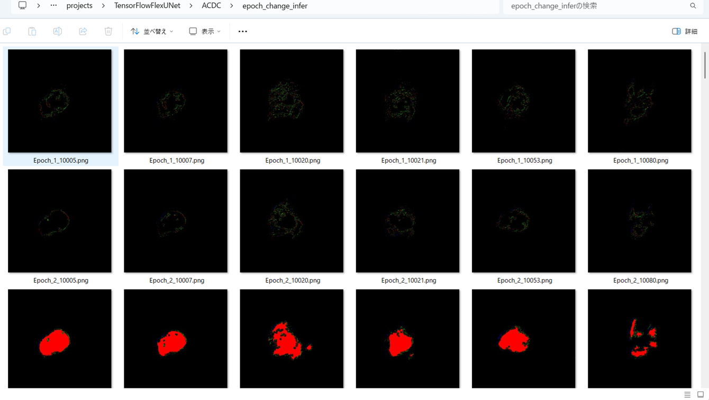 
 
<b>Epoch_change_inference output at middlepoint (epoch 16,17,18)</b> 
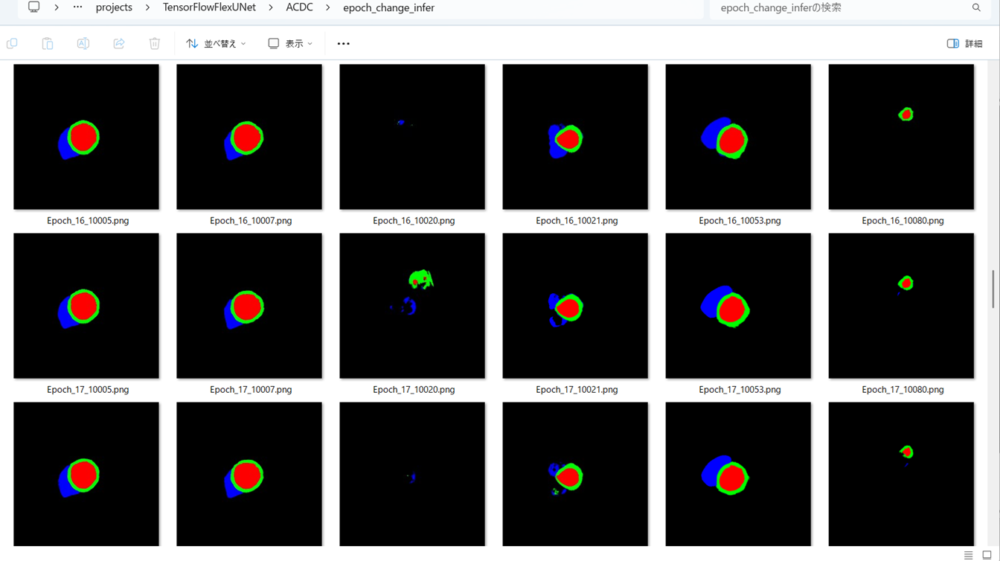 
 
<b>Epoch_change_inference output at ending (epoch 33,34,35)</b> 
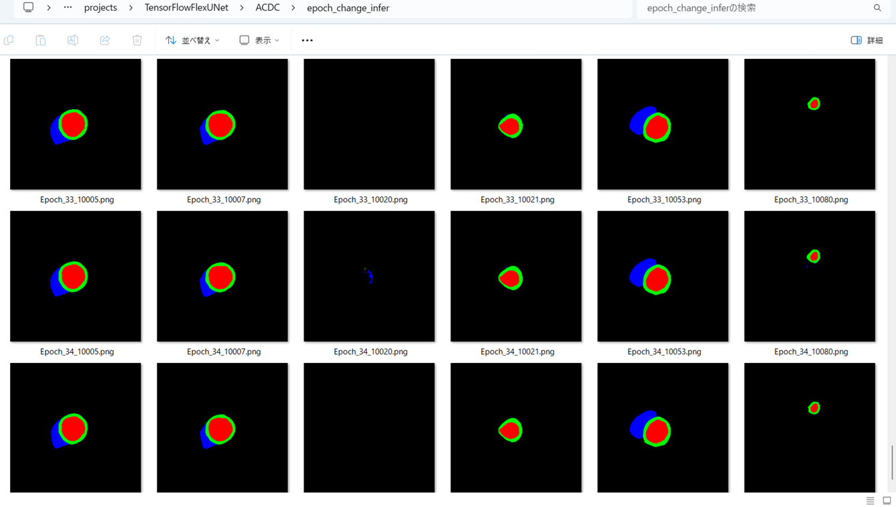 
 
In this experiment, the training process was stopped at epoch 35 by EearlyStopping callback.  
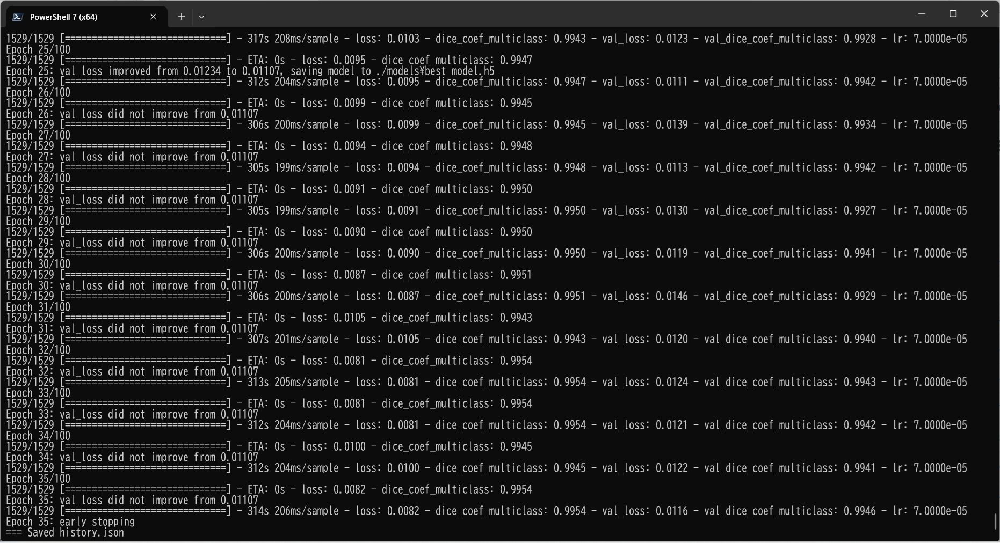 
 

<a href="./projects/TensorFlowFlexUNet/ACDC/eval/train_metrics.csv">train_metrics.csv</a> 
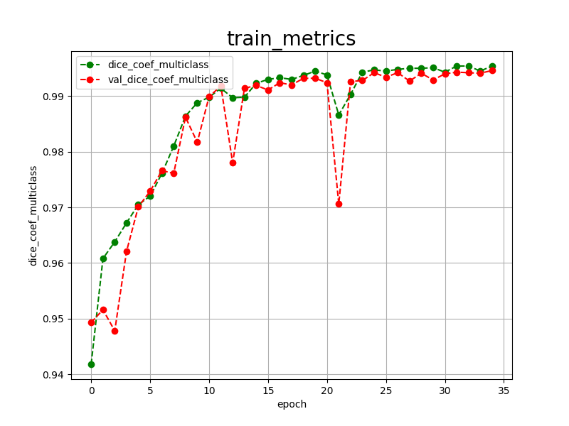 

 
<a href="./projects/TensorFlowFlexUNet/ACDC/eval/train_losses.csv">train_losses.csv</a> 
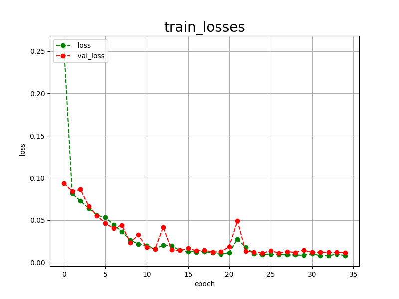 

 

<h3>
4 Evaluation
</h3>
Please move to <b>./projects/TensorFlowFlexUNet/ACDC</b> folder, 
and run the following bat file to evaluate TensorFlowFlexUNet model for ACDC. 
<pre>
./2.evaluate.bat
</pre>
This bat file simply runs the following command.
<pre>
python ../../../src/TensorFlowFlexUNetEvaluator.py ./train_eval_infer_aug.config
</pre>

Evaluation console output: 
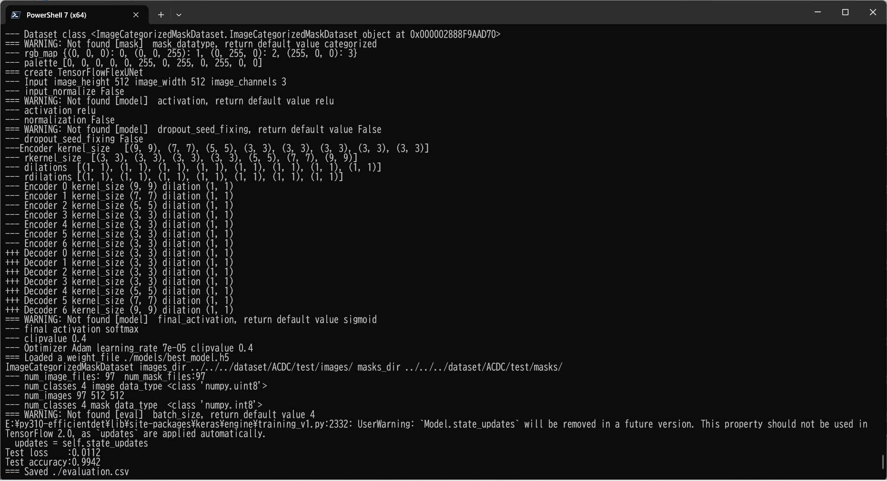
  

<a href="./projects/TensorFlowFlexUNet/ACDC/evaluation.csv">evaluation.csv</a> 
The loss (categorical_crossentropy) to this ACDC/test was low and dice_coef_multiclass high as shown below.
 
<pre>
categorical_crossentropy,0.0112
dice_coef_multiclass,0.9942

</pre>
 

<h3>
5 Inference
</h3>
Please move <b>./projects/TensorFlowFlexUNet/ACDC</b> folder 
,and run the following bat file to infer segmentation regions for images by the Trained-TensorFlowFlexUNet model for ACDC. 
<pre>
./3.infer.bat
</pre>
This simply runs the following command.
<pre>
python ../../../src/TensorFlowFlexUNetInferencer.py ./train_eval_infer_aug.config
</pre>

<b>mini_test_images</b> 
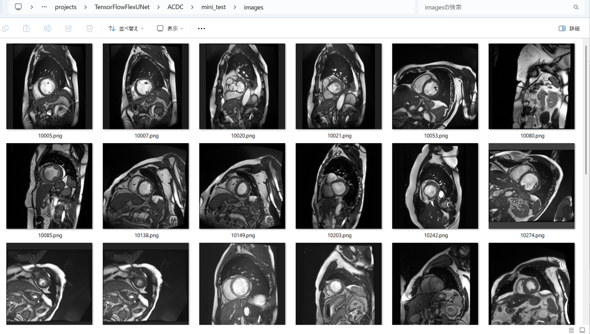 
<b>mini_test_mask(ground_truth)</b> 
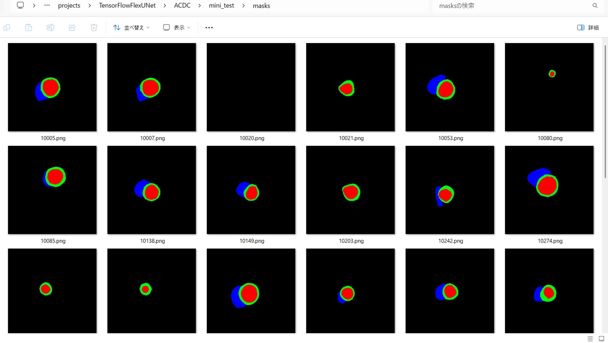 

<b>Inferred test masks</b> 
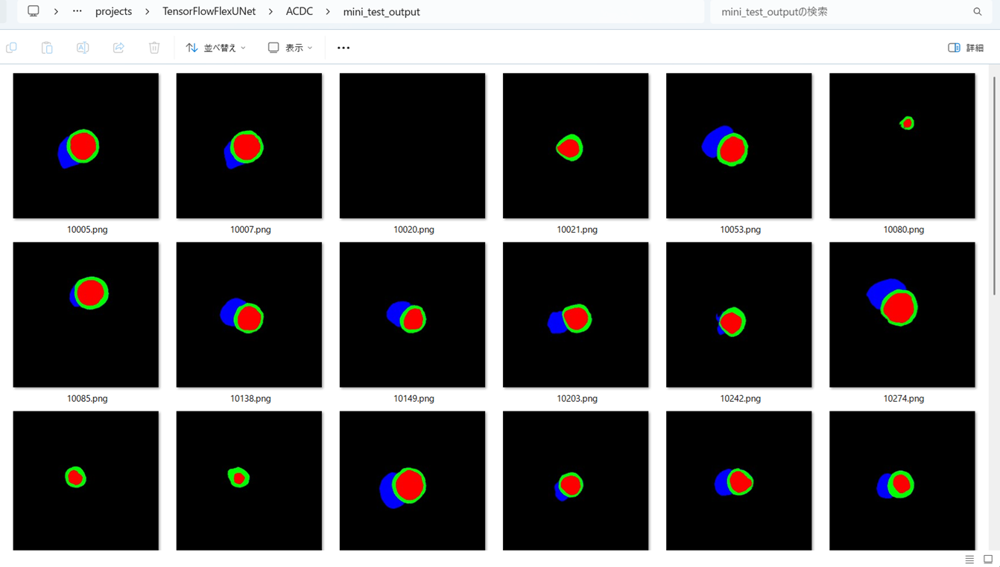 
 

<b>Enlarged images and masks of 512x512 pixels Cardiac images</b> 
<table>
<tr>
<th>Image</th>
<th>Mask (ground_truth)</th>
<th>Inferred-mask</th>
</tr>

<tr>
<td>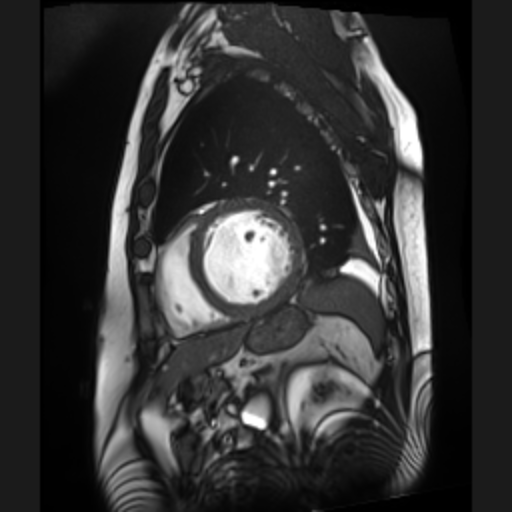</td>
<td>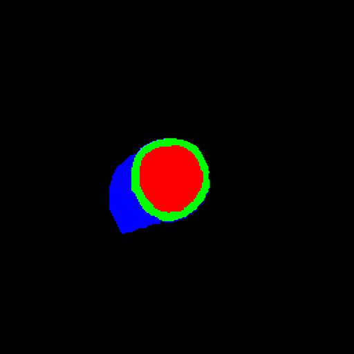</td>
<td>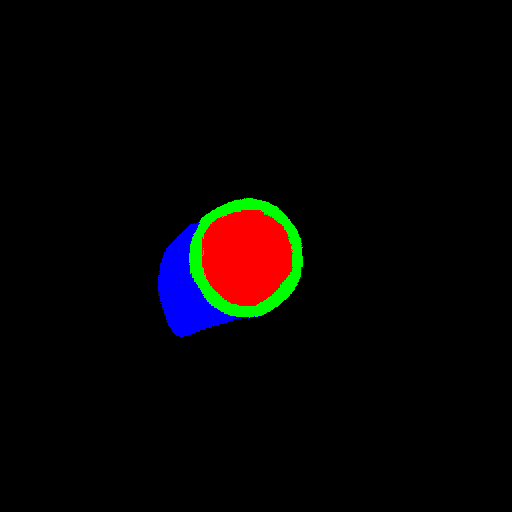</td>
</tr>

<tr>
<td>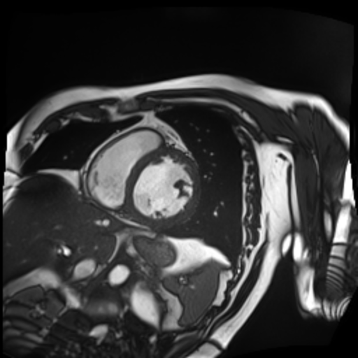</td>
<td></td>
<td>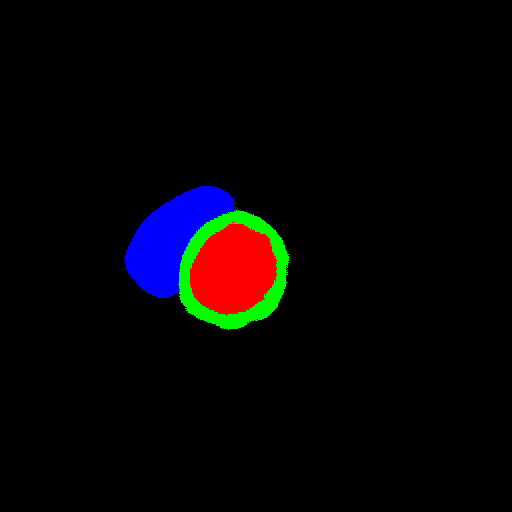</td>
</tr>

<tr>
<td></td>
<td></td>
<td></td>
</tr>

<tr>
<td>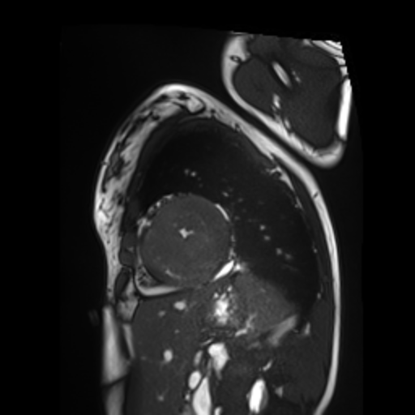</td>
<td></td>
<td>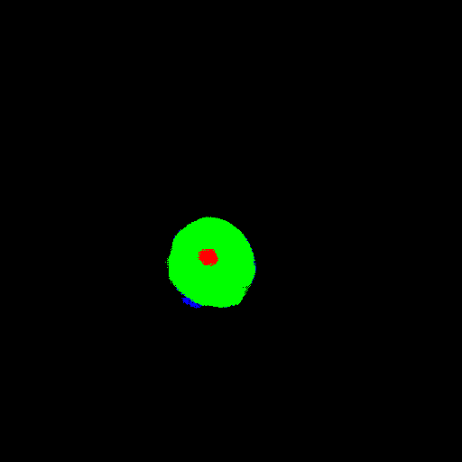</td>
</tr>

<tr>
<td>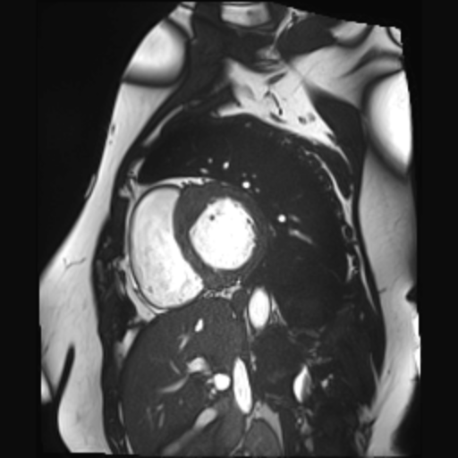</td>
<td>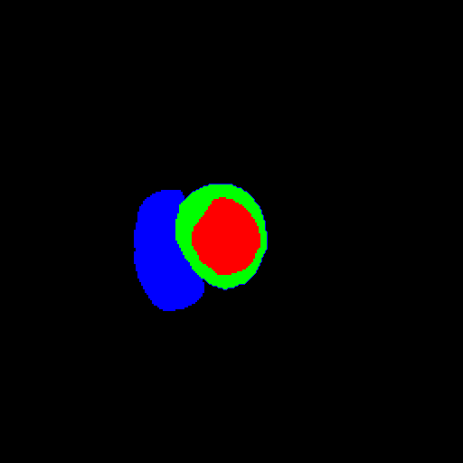</td>
<td>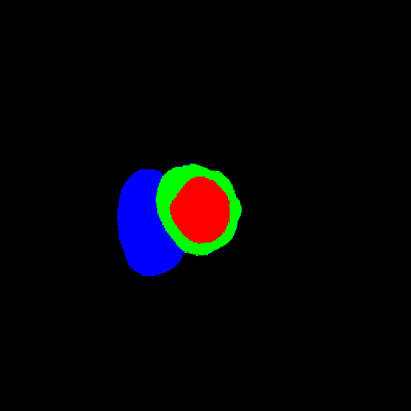</td>
</tr>

<tr>
<td>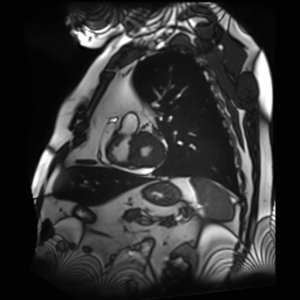</td>
<td>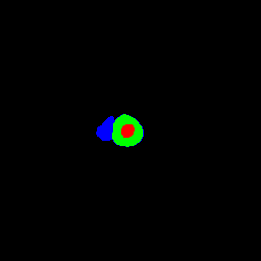</td>
<td>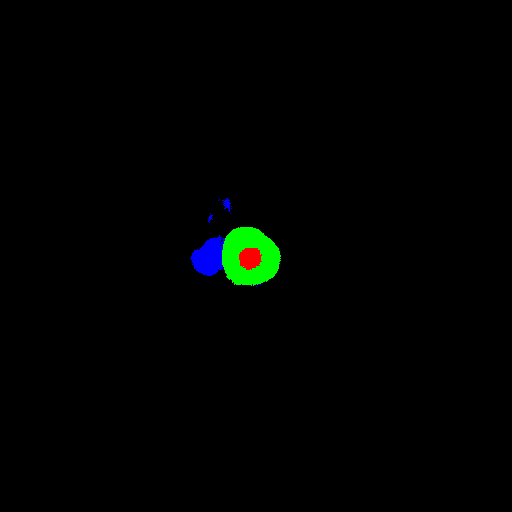</td>
</tr>
</table>

 
<h3>
References
</h3>
<b>1. Automated Cardiac Diagnosis Challenge (ACDC)</b> 
<a href="https://www.creatis.insa-lyon.fr/Challenge/acdc/databases.html">https://www.creatis.insa-lyon.fr/Challenge/acdc/databases.html
</a>.
 
 

<b>2. Learning to Segment from Scribbles using Multi-scale Adversarial Attention Gates</b> 
Gabriele Valvano, Andrea Leo, Sotirios A. Tsaftaris  
<a href="https://arxiv.org/pdf/2007.01152">https://arxiv.org/pdf/2007.01152</a>
  

<b>3. An Exploration of 2D and 3D Deep Learning Techniques for Cardiac MR Image Segmentation</b>
 Christian F. Baumgartner, Lisa M. Koch, Marc Pollefeys, Ender Konukoglu<br.
<a href="https://arxiv.org/pdf/1709.04496">https://arxiv.org/pdf/1709.04496</a>
  

<b>4. acdc_segmenter</b> 
Christian F. Baumgartner 
<a href="https://github.com/baumgach/acdc_segmenter">https://github.com/baumgach/acdc_segmenter</a>
 
 
<b>5. TensorFlow-FlexUNet-Image-Segmentation-Model</b> 
Toshiyuki Arai antillia.com  
<a href="https://github.com/sarah-antillia/TensorFlow-FlexUNet-Image-Segmentation-Model">
https://github.com/sarah-antillia/TensorFlow-FlexUNet-Image-Segmentation-Model
</a>
 
 

